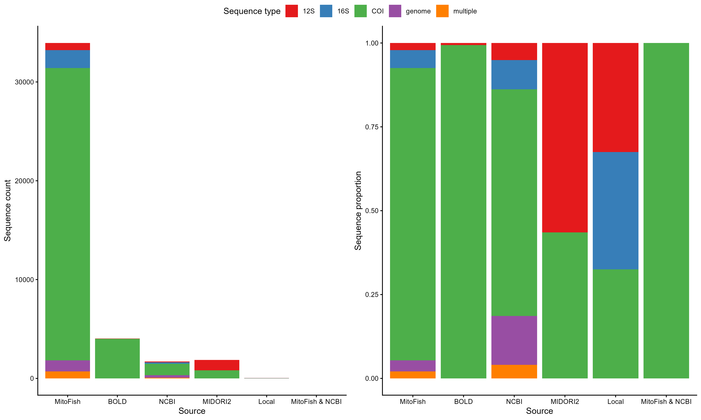
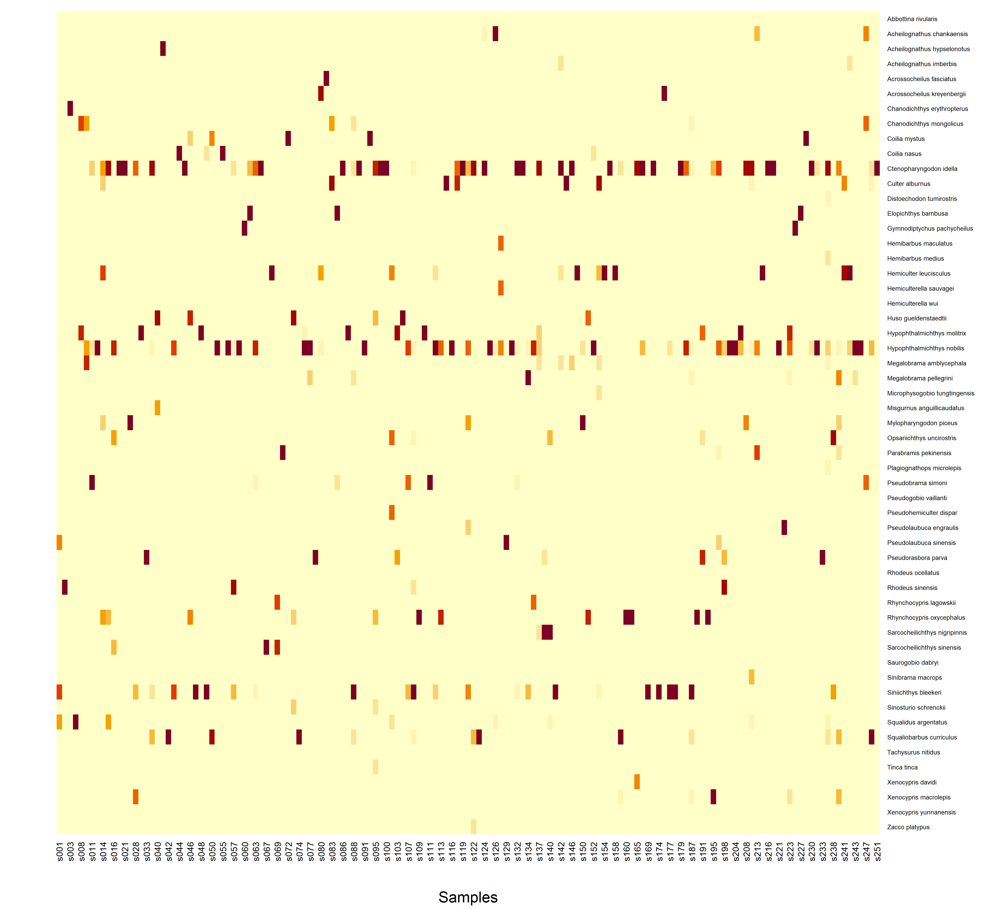

```{r include=FALSE}
knitr::opts_chunk$set(echo = TRUE, eval = FALSE, tidy = TRUE, collapse = TRUE, comment = "#>", fig.path = "casestudy-")
library(regionbarcoder)
library(tidyverse)
output_path <- system.file("extdata", "case_study_outputs.rds", package = "regionbarcoder")
output <- readRDS(output_path)
```

# Introduction

This vignette demonstrates the complete workflow of the `regionbarcoder` package using a real-world environmental DNA (eDNA) dataset from the Yangtze River basin. We will walk through installing the `YZFishDB` reference database, auditing its taxonomic and marker coverage, assessing its barcoding gap diagnostic, benchmarking assignment methods (Exact vs. BLASTn), resolving taxonomic ties, and generating a final species-by-site ecological matrix.

*Note: This case study utilizes the `YZFishDB.db` reference database. To run this code locally, ensure you update the file paths in the setup chunk to match your system.*

# 1. Database Setup and Configuration

## Installing the Reference Database

This case study uses `YZFishDB`, a curated mitochondrial DNA reference database (~600MB) hosted on Zenodo and can be downloaded and cached locally using the built-in installation function:

```{r}
library(regionbarcoder)

# Download and verify the YZFishDB release from Zenodo
rb_install_db()

# Inspect the release metadata
rb_yzfishdb_release()
```

Once installed, connecting to the database is seamless:

```{r}
con <- rb_connect()
rb_tables(con) # Inspect available tablles in the database
```

## Loading libraries

For this case study, we also load `tidyverse` for data manipulation and `Biostrings` for FASTA handling.

```{r message=FALSE, warning=FALSE}
library(regionbarcoder)
library(tidyverse)
library(Biostrings)
```

# 2. Auditing the Reference Database

Before assigning sequences, it is crucial to understand the composition of the reference database. `regionbarcoder` provides built-in functions to audit taxonomic and marker coverage dynamically.

## Taxonomic and Source Coverage

### Audit QC Flags

```{r}
qc_summary <- rb_qc_summary(con)
print(qc_summary)
```

```{r eval=TRUE, echo=FALSE}
print(output$qc_summary)
```

### Audit taxonomic coverage by marker

```{r eval=FALSE}
species_12s <- rb_list_taxa(con, rank = "species", marker = "12S")
species_all <- rb_list_taxa(con, rank = "species")

head(output$species_12s)
head(output$species_all)

cat("Species with 12S data:", nrow(species_12s), "\n")
cat("Species with any marker data:", nrow(species_all), "\n")
```

```{r eval=TRUE, echo=FALSE}
head(output$species_12s)
head(output$species_all)

cat("Species with 12S data:", nrow(output$species_12s), "\n")
cat("Species with any marker data:", nrow(output$species_all), "\n")
```

### Audit source coverage

```{r}
source_cov <- rb_source_coverage(con)
print(head(source_cov))
```

```{r eval=TRUE, echo=FALSE}
head(output$source_cov)
```

We can visualize the provenance of the reference sequences to understand the composition of the database across different markers.

```{r}
source_cov_plot_data <- source_cov %>%
  mutate(Source = factor(source, 
                         levels = c("mitofish", "bold", "ncbi", "midori", "local", "mitofish|ncbi"),
                         labels = c("MitoFish", "BOLD", "NCBI", "MIDORI2", "Local", "MitoFish & NCBI")))

p1 <- ggplot(source_cov_plot_data, aes(x = Source, y = n_sequences, fill = seq_type)) +
  geom_bar(stat = "identity") +
  scale_fill_brewer(palette = "Set1", name = "Marker") +
  labs(y = "Sequence Count", title = "Absolute Sequence Counts by Source") +
  theme_classic() + theme(axis.text.x = element_text(angle = 45, hjust = 1))

p2 <- ggplot(source_cov_plot_data, aes(x = Source, y = n_sequences, fill = seq_type)) +
  geom_bar(stat = "identity", position = "fill") +
  scale_fill_brewer(palette = "Set1", name = "Marker") +
  labs(y = "Proportion", title = "Proportion of Markers by Source") +
  theme_classic() + theme(axis.text.x = element_text(angle = 45, hjust = 1))

ggpubr::ggarrange(p1, p2, common.legend = TRUE, ncol = 2)
```

```{r eval=TRUE, echo=FALSE, out.width="80%"}

```

## Barcode Gap Diagnostic

A critical step in metabarcoding is validating the marker's ability to distinguish species. The "barcode gap" represents the difference between maximum intraspecific (within species) and mininum interspecific (between species) genetic distances.

Currently the barcode gap metrics are imported as a separate CSV. Here we assess the median barcode gap by the number of species with "12S" sequences in the `YZFishDB` reference database.

```{r eval=TRUE}
gap_metrics <- rb_read_barcode_gap(marker = '12S')

gap_summary <- gap_metrics |>
  mutate(gap_median = median_inter>median_intra) |>
  group_by(gap_median) |>
  summarise(n_species = n_distinct(species))

gap_summary
```

# 3. Preparing ASV Data

The package requires ASV sequences in a FASTA file and a corresponding count table. We extract these from a standard DADA2 sequence table (`seqtab`).

In this example, we used the ASV dataset included in the package as the `asv_path` and set a path for the FASTA file to the exported (`asv_fasta <- "data/"`).

```{r}
asv_path <- "yz_12s_r1.rds"
asv_fasta <- "data/"

seqtab <- readRDS(asv_path)

# Extract sequences and assign standardized ASV IDs
asv_seqs <- colnames(seqtab)
asv_ids <- sprintf("ASV_%05d", seq_along(asv_seqs))
names(asv_seqs) <- asv_ids

# Write to FASTA
writeXStringSet(DNAStringSet(asv_seqs), filepath = asv_fasta)

# Create ASV count table (Samples x ASVs)
asv_table <- as.data.frame(t(seqtab))
asv_table$asv_id <- asv_ids
asv_table <- asv_table[, c("asv_id", setdiff(names(asv_table), "asv_id"))]
```

```{r eval=TRUE, include=FALSE}
asv_path <- system.file("extdata","yz_12s_r1.rds", package = "regionbarcoder")
seqtab <- readRDS(asv_path)
asv_seqs <- colnames(seqtab)
asv_ids <- sprintf("ASV_%05d", seq_along(asv_seqs))
names(asv_seqs) <- asv_ids
asv_table <- as.data.frame(t(seqtab))
asv_table$asv_id <- asv_ids
asv_table <- asv_table[, c("asv_id", setdiff(names(asv_table), "asv_id"))]
```

# 4. Taxonomic Assignment: Exact vs. BLASTn

A key feature of `regionbarcoder` is the ability to easily benchmark different assignment methods. Here, we compare the dependency-free exact matching method against the robust BLASTn method.

```{r}
# Run EXACT Match
t_exact <- system.time({
  res_exact <- rb_assign_edna(
    asv_fasta = asv_fasta, con = con, marker = "12S", 
    method = "exact", out_dir = blast_out_dir
  )
})

# Run BLASTn
t_blast <- system.time({
  res_blast <- rb_assign_edna(
    asv_fasta = asv_fasta, con = con, marker = "12S", 
    method = "blastn", out_dir = blast_out_dir,
    blastn = blastn_path, makeblastdb = makeblastdb_p
  )
})

# Compare Results
comparison <- data.frame(
  Method = c("Exact", "BLASTn"),
  Time_seconds = c(t_exact[3], t_blast[3]),
  ASVs_Assigned = c(
    sum(res_exact$assignment_status != "no_match"),
    sum(res_blast$assignment_status != "no_match")
  ),
  Success_Rate_Pct = c(
    round(mean(res_exact$assignment_status != "no_match") * 100, 2),
    round(mean(res_blast$assignment_status != "no_match") * 100, 2)
  )
)
print(comparison)
```

```{r eval=TRUE, echo=FALSE}
output$comparison
```

*Note: As expected, Exact matching is significantly faster but yields a lower success rate due to its strict 100% identity requirement. BLASTn is the recommended method for complex environmental samples.*

# 5. Resolving Ambiguities (Manual Curation)

The upgraded BLASTn pipeline uses advanced metrics (`ccovs`, `bitscore_pb`) and automatically flags perfect ties as "`check_full_tie`". This allows researchers to easily export and manually curate ambiguous ASVs based on biogeography or taxonomy.

Example: `ASV_07559`, `ASV_08335`, `ASV_09885` are a ties between *Gymnodiptychus pachycheilus* and *Schizopygopsis kialingensis*. Based on literature, *G. pachycheilus* is the correct assignment for this region.

```{r}
ties <- res_blast %>% filter(assignment_status == "check_full_tie")
cat("Number of ASVs requiring manual curation:", nrow(ties), "\n")

if(nrow(ties) > 0) {
  print(arrange(ties[, c("asv_id", "tie_taxa", "ccovs", "bitscore_pb")], tie_taxa, asv_id))
}

res_blast <- res_blast |>
  mutate(species = case_when(asv_id %in% c("ASV_07559", "ASV_08335", "ASV_09885") ~ "Gymnodiptychus pachycheilus",
                             TRUE ~ species),
         assignment_status = case_when(asv_id %in% c("ASV_07559", "ASV_08335", "ASV_09885") ~ "unique",
                                       TRUE ~ assignment_status),
         tie_taxa = case_when(asv_id %in% c("ASV_07559", "ASV_08335", "ASV_09885") ~ NA_character_,
                              TRUE ~ tie_taxa))
```

```{r echo=TRUE, eval=TRUE}
cat("Number of ASVs requiring manual curation:", nrow(output$ties), "\n")

if(nrow(output$ties) > 0) {
  print(arrange(output$ties[, c("asv_id", "tie_taxa", "ccovs", "bitscore_pb")], tie_taxa, asv_id))
}
```

# 6. Building the Ecological Matrix

Finally, we aggregate the curated ASV counts into a species-by-sample matrix, dropping any remaining ambiguous or unassigned ASVs.

```{r}
species_sample <- rb_build_species_matrix(
  assignment = res_blast,
  asv_table = asv_table,
  include_ambiguous = FALSE, 
  unassigned = FALSE         
)

cat("Final ecological matrix dimensions (Species x Samples):", dim(species_sample), "\n")
```

```{r eval=TRUE, echo=TRUE}
species_sample <- rb_build_species_matrix(
  assignment = output$res_blast,
  asv_table = asv_table,
  include_ambiguous = FALSE, 
  unassigned = FALSE         
)

cat("Final ecological matrix dimensions (Species x Samples):", dim(species_sample), "\n")
```

## Mapping to Site Metadata and Visualization

To visualize the data, we map the raw sample IDs to their corresponding site IDs and generate a heatmap.

```{r}
site_path <- "yz_edna_env_tbl.rds"
site_info <- readRDS(site_path)

# Pivot and join with site metadata
species_matrix <- species_sample %>%
  pivot_longer(-species, names_to = "file", values_to = "abundance") %>%
  inner_join(dplyr::select(site_info, file, site, site_id), by = "file") %>%
  arrange(site_id) %>%
  dplyr::select(species, site_id, abundance) %>%
  filter(abundance > 0) %>%
  pivot_wider(names_from = site_id, values_from = abundance, values_fill = 0) %>%
  arrange(species) %>%
  column_to_rownames('species') %>%
  as.matrix()

heatmap(species_matrix, Colv = NA, Rowv = NA, scale = 'column', 
        revC = TRUE, xlab = "Sites", cexRow = 0.5, cexCol = 0.7,
        main = "Species Abundance Across Yangtze River Sites")
```

```{r eval=TRUE, echo=FALSE, out.width="80%"}

```

# 7. Exporting Pipeline-Ready References

Beyond taxonomic assignment, `regionbarcode` can format the user-defined selection of the reference database for use in other popular bioinformatics pipelines.

```{r}
native_12s <- rb_get_sequences(con, marker = "12S", occurrence = "native")

rb_export_dada2(native_12s, "refs_dada2.fasta")
rb_export_qiime2(native_12s, "refs_qiime2.fasta", "refs_qiime2_tax.tsv")
rb_export_blastn(native_12s, "refs_blastn.fasta")
rb_export_usearch(native_12s, "refs_usearch.fasta")
```

These exports preserve a consistent seven-rank taxonomy string while adapting headers to DADA2, QIIME2, BLASTN, and USEARCH/VSEARCH conventions.

# Conclusion

This case study demonstrates how `regionbarcoder` streamlines the eDNA taxonomic assignment workflow. By dynamically querying the `YZFishDB` database, utilizing robust alignment metrics (`ccovs`), and providing a standardized framework for tie curation (`check_full_tie`), the package ensures reproducible, transparent, and bioinformatically rigorous species assignments.

```{r}
rb_disconnect(con)
```
